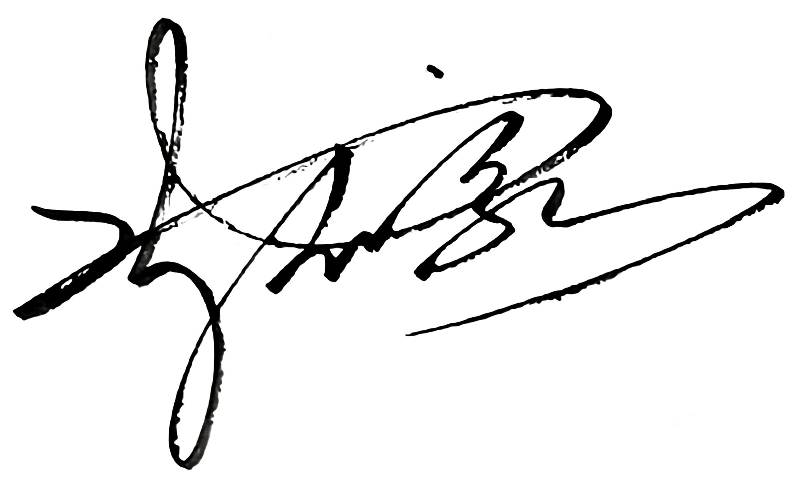

<!-- =======================
  Senhao Chen | GitHub Profile README
  Repo: ChenSenhao0104/ChenSenhao0104
======================== -->

<h1 align="center">Senhao Chen</h1>

  

  Undergraduate @ Hangzhou Dianzi University Information Engineering School(Hziee) 
  Focus: Computer Vision for Industrial Intelligence · VR Simulation · Engineering-oriented R&D

  <a href="https://chensenhao0104.github.io/">Portfolio (GitHub Pages)</a> ·
  <a href="mailto:cccssshhh666@gmail.com">Email</a> /
  <a href="mailto:1764536087@qq.com">Backup Email</a> ·
  <a href="TODO">Blog</a> ·
  <a href="TODO">CV / Resume</a> ·
  <a href="TODO">Google Scholar / ResearchGate </a>

---

## Academic & Engineering Trajectory

- **Academic Performance (Comprehensive Evaluation / Major Rank)**
	- 2023–2024 (Fall)  : **19 / 309** · Theory Avg: **84.79** · Total: **81.97**
	- 2023–2024 (Spring):  **1 / 329** · Theory Avg: **90.12** · Total: **91.50**
	- 2024–2025 (Fall)  :  **1 / 289** · Theory Avg: **97.88** · Total: **96.20**
	- 2024–2025 (Spring):  **1 / 290** · Theory Avg: **93.54** · Total: **93.31**

- **Timeline**
	- **2023/09**: Started CS undergraduate study at Hziee (School of Computer Science)
	- **2023/09–2024/02**: Core coursework in C/C++，Python,C#, Java，JavaScript/TypeScript，HTML，CSS，Data Structures & Algorithms, OOP, programming fundamentals; explored VR & CV direction
	- **2023/12–2024/02**: Implement the Alma mater return visit program; Reported by Xiangshan County media center — **[Web link](https://app.cnxsg.cn/webDetails/news?id=7846213&tenantId=76&uid=65bf309011237004a2d22e96)**
	- **2023/09–2024/11**: Co-developed vehicle inspection VR platform with FAW-Volkswagen; deployed internally
	- **2024/12–2026/02**: Signed R&D cooperation with Han’s Laser on multi-source visual defect inspection engine
	- **2025/05–2026/01**: 2026 Green & low-carbon expo proposal research (competition project)

- **Keywords**
	- Computer Vision & Industrial Intelligence · VR/Virtual Simulation · Engineering Practice

<!-- my-skills -->

| Property                      | Data                                                         |
| ----------------------------- | ------------------------------------------------------------ |
| **Core Focus**                |     |
| **Languages**                 |           |
| **Engines & App Frameworks**  |    |
| **AI / CV Stack**             |        |
| **Tooling & Collaboration**   |               |
| **Databases & Data Handling** |   -555555?style=flat&logoColor=white) |

  
<b>AI Productivity (Optional)</b>

   

     

<!-- my-skills (clean & credible) -->

| Property                     | Data                                                         |
| ---------------------------- | ------------------------------------------------------------ |
| **Core Focus**               |     |
| **Languages**                |             |
| **Engines & GUI**            |    |
| **AI / CV Stack**            |         |
| **Tooling & Collaboration**  |           |
| **Data & Storage  (Basics)** |  -555555?style=flat&logoColor=white)  |

  
<b>AI Productivity & Research (Optional)</b>

   

  
  
  
  

---

## Selected Projects

### A. VR Training & Assessment System for Vehicle Inspection of Motor Vehicles (Core Member · Vice Captain)

**Overview**  
	A Unity-based VR platform that simulates real vehicle inspection workflows (covering core inspection stations: toe adjustment (wheel alignment), headlamp beam aiming test (using a beam setter), and hub dynamometer / roller bench test (wheel-rotation-based testing)).  
	Supports practice / mock exam / formal assessment with operation logging and scoring analysis, reducing equipment occupancy and training cost.

**My Contributions**

- Designed and implemented interactive workflows and scoring logic for **toe adjustment** and **headlight inspection** modules
- Built the **operation record & score evaluation** subsystem (rule configuration, statistics, basic visualization UI)
- Assisted in scene integration and performance optimization for stable FPS on common hardware
- Collaborated with instructors and enterprise partner (FAW-Volkswagen Talent Development & Empowerment Center) for iterative delivery

**Tech**: Unity · C# · VR Simulation · Interaction Design · Assessment Logic

**Gallery**

<pre>
      
</pre>

**Links**: Repo: TODO · Demo/Video: TODO(Under improvement)

---

### B. Surface Defect Visual Inspection System for Vehicle Parts (Team Lead)

**Overview**  
An industrial surface-defect detection system based on **YOLOv8** for **rolled-in scale (RS)**, **patches (Pa)**, **cracks (Cr)**, **pitted surface (PS)**, **inclusions (In)**, and **scratches (Sc)**, covering an end-to-end pipeline from dataset construction to model training and deployment.

**My Contributions**

- Led algorithm design and training workflow: labeling specification, augmentation strategy, hyperparameter tuning
- Exported YOLOv8 model to **ONNX**, handled dependency adaptation and performance tuning
- Designed a unified inference pipeline balancing detection quality and real-time performance
- Coordinated technical alignment with **Han’s Laser Technology Industry Group** for engineering-grade deployment direction

**Tech**: YOLOv8 · Object Detection · Deep Learning · ONNX · Industrial Vision

**Gallery**  

<pre>
      
</pre>

**Links**: Repo: TODO · Model/Report: TODO(Under improvement)

---

### C. 2026 Hangzhou International Green & Low-Carbon Industry Expo Proposal (Competition Project · Vice Captain)

> Note: Competition project (simulated expo planning), not a real offline expo.

**Overview**  
A comprehensive expo planning proposal under the theme “绿韵长河共潮生，智链零碳绘杭城”, integrating national “Dual-Carbon” strategy with Hangzhou’s green industry layout.  
Explores “Green & Low-Carbon + Digital Tech + Urban Expo” as a structured solution.

**My Contributions**

- Co-built the overall proposal framework and thematic boundaries (zero-carbon tech, green city, circular economy, etc.)
- Took ownership of key chapters: initiation analysis, basic info, policy linkage, activity design, emergency strategy
- Proposed digital exhibition concepts (interactive screens, data visualization, virtual exhibition hall)
- Contributed to risk response (policy change, self-sustainability) and differentiation strategy

**Tech**: Dual-Carbon Strategy · Green & Low-Carbon Industry · Expo Planning · Digital Expo

**Gallery**  

<pre>
       
</pre>

**Links**: Document: TODO · Poster/Slides: TODO(Under improvement)

---

## Honors (Selected)

- **National 1st Prize** · 17th National 3D Digital Innovation Design Competition (2024-12-01)
- **National 1st Prize** · 7th China Virtual Reality Competition (National Finals) (2024-12-28)
- **National 1st Prize** · 19th National Business Elite Challenge — Culture, Tourism & Exhibition Innovation and Entrepreneurship Practice Competition (2025-11-10)
- **National 2nd Prize** · 2nd National AI Application Scenario Innovation Challenge (2024-10-27)
- **National 2nd Prize** · 19th China Good Idea & National Digital Art Design Competition (National Finals) (2025-08-25)
- **National 2nd Prize** · 13th National College Students Digital Media Technology Works & Creativity Competition (National Finals) (2025-10-01)

  
More awards (click to expand)

- **National 3rd Prize** · 15th China Undergraduate Service Outsourcing Innovation & Entrepreneurship Competition — Enterprise Track (National Finals) (2024-08-02)
- **National 3rd Prize** · 16th China Undergraduate Service Outsourcing Innovation & Entrepreneurship Competition — Enterprise Track (National Finals) (2025-07-01)
- **National 3rd Prize** · 10th China Collegiate Computing Competition — Network Technology Challenge (Grand Final) (2025-07-01)
- **National 3rd Prize** · 18th China College Students Computer Design Competition (2025-07-01)
- **National 3rd Prize** · 13th Future Designer — National College Digital Art Design Competition (National Finals) (2025-08-28)
- **National 3rd Prize** · 6th National Exhibition Planning & Creative Competition (National Finals) (2025-12-09)
- **National 3rd Prize** · 3rd National College Students Low-Carbon Circular Technology Innovation Competition (2024-09-01)
- **National 3rd Prize** · 10th Oriental Design Awards — National College Innovation Design Competition (2024-08-02)
- **Provincial Special Grand Prize (Top Award)** · 17th National 3D Digital Innovation Design Competition — Zhejiang Province Division  (2024-10-01)
- **Provincial Top-10 Placement (7th Place)** · Zhejiang Province Aeromodelling (UAV/Drone) Open Competition (2024-12-22)
- **Provincial 1st Prize** · 20th Zhejiang Province College Students E-commerce Competition (2025-06-01)
- **Provincial 1st Prize** · 15th Zhejiang Province Exhibition Planning & Creative Competition (2025-10-16)

>As of **2025/12/17**, I have received **26 national-level awards** and **dozens of provincial-level awards**. The honors listed above are **selected highlights**; additional national/provincial awards can be provided **upon request**.

---

## Collaboration & Merch

If you’d like to support **EngineRealm (擎境科技)** or explore collaboration opportunities, you can also purchase our team merch.

  

- **Item**: EngineRealm Team T-shirt  
- **Price**: **$6 / piece** *(excluding shipping; bulk orders negotiable)*  
- **Size / Color**:S–XXL · Black / White / Navy
- **How to order**: [cccssshhh666@gmail.com](mailto:cccssshhh666@gmail.com?subject=Merch%20Order%20-%20EngineRealm%20T-shirt) / [1764536087@qq.com](mailto:1764536087@qq.com?subject=Merch%20Order%20-%20EngineRealm%20T-shirt)
- **Business inquiries**: [cccssshhh666@gmail.com](mailto:cccssshhh666@gmail.com?subject=Business%20Inquiry%20-%20EngineRealm) / [1764536087@qq.com](mailto:1764536087@qq.com?subject=Business%20Inquiry%20-%20EngineRealm) *(sponsorship · enterprise collaboration · campus partnership)*

---

## Beyond Work

- **Sports**: F1 fan · Basketball · Karting · Badminton · Billiards · Handball · E-sports · Table Tennis · Tennis · Sailing · Football (mid-to-advanced)
- **Volunteer**: Large-scale event volunteering (CCTV “Win in AI+” show, Hangzhou/Linan marathons, Family Sailing Championships, etc.)
- **Conferences**: WAIC 2025, AI Global Governance HL Meeting 2025, Huawei Connect 2024, etc.

---

## Contact

- Email (Primary): [cccssshhh666@gmail.com](mailto:cccssshhh666@gmail.com)
- Email (Backup): [1764536087@qq.com](mailto:1764536087@qq.com)
- Portfolio: [Portfolio (GitHub Pages)](https://chensenhao0104.github.io/)
- Location: Hangzhou, China

  

